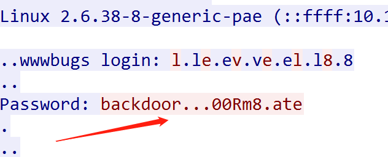

# 04.能找到密码嘛

题目提供了一个网络抓包文件 `passwd.pcap` ，用 `wireshark` 打开，在任意数据行上点鼠标右键，选择“**追踪流-TCP流**”，如图：

为了看清楚非显示字符到底是什么，窗口下方选择“Show data as **Hex 转储**”，可见客户端实际的击键输入为：

> backdoor`\x7f\x7f\x7f`00Rm8`\x7f`ate`\x0d`

`\x0d` 是回车键。`\x7f` 在上古的终端里是 `退格` 键。因此客户端实际发送给服务器的密码为：

> backd00Rmate

此即答案。
