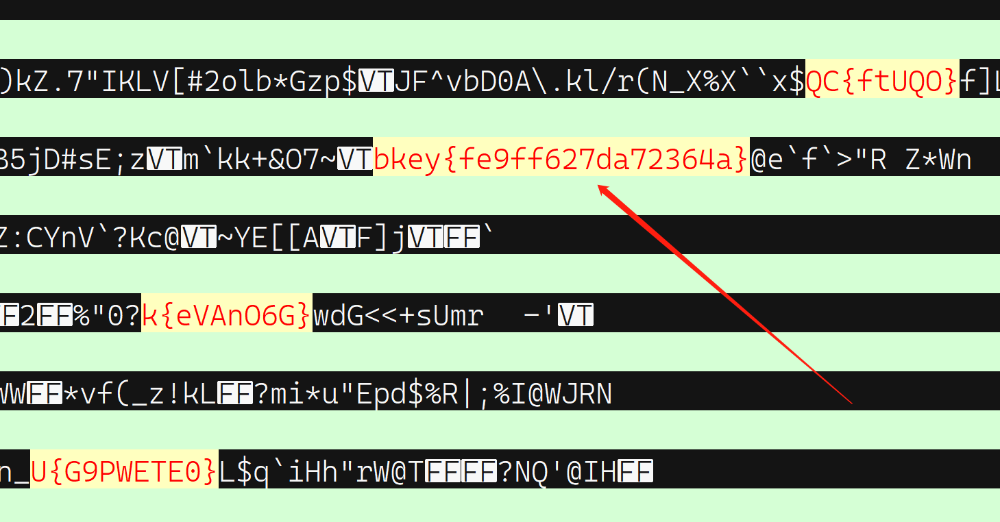

# 06.这么多文件，怎么处理

题目给了一个zip文件，解压后是500个文本文件，打开观察，绝大部分内容是可打印字符，应该不是二进制文件，考虑在这些文件中搜索特定字符串。在多个文件中搜索有很多方法，可以写脚本，在windows上可以用 `findstr` ，在linux上可以用 `grep` ，而多数文本处理程序也有这个功能，例如如果装有 **notepad++** ，菜单中选择 `搜索-在文件中查找` 即可。

使用 notepad++ 。首先尝试查找 `flag` ，没有找到。然后尝试以正则模式 `{[\x20-\x7f]+}`（即：一对花括号包裹着至少一个可打印字符）进行查找，匹配到5228处，太多。只好凭猜测逐步缩小查找范围。用 `{[a-zA-Z0-9]+}` 匹配到610处，用 `{[a-zA-Z0-9]{5,50}}` 匹配到98处，当使用正则模式 `[a-zA-Z]+{[a-zA-Z0-9]{5,50}}` 进行查找时，匹配结果只有56处，人工浏览感觉有一处嫌疑最大，如下图：

提交 `key{fe9ff627da72364a}` 通过。

这题目相当无聊！
