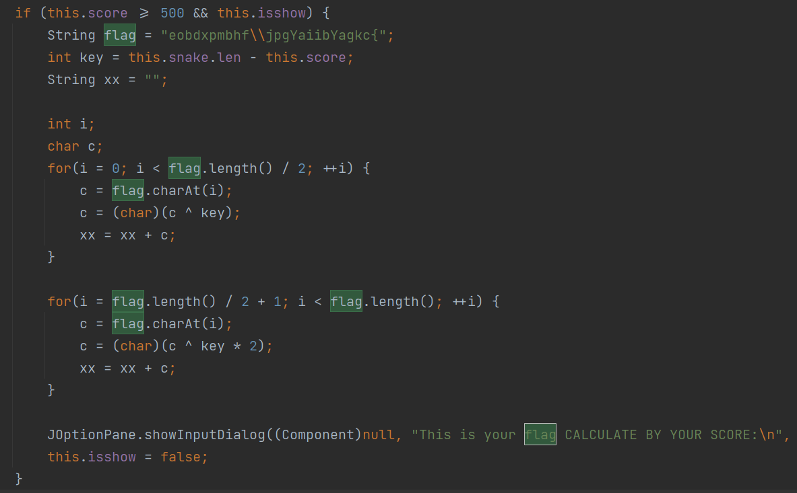

# 01.记忆中的贪吃蛇

题目只提供了一个压缩文件 `Snake.rar` ，解压后是一个完整的java游戏程序，除了素材外，程序主体是文件 `Snake.jar` ，解压后得到若干个java字节码文件。既然是逆向题目，自然要进行反编译。如果电脑上有 `IntelliJ IDEA` ，可以直接用 `IntelliJ IDEA` 打开字节码文件，`IntelliJ IDEA` 会自动执行反编译。首先从入口文件 `Main.class` 开始，反编译后查找字符串 `flag` ，无果。大致浏览程序代码后，解题目标转向 `Game.class` ，这是游戏程序的主体逻辑所在，反编译后查找字符串 `flag` ，结果如图：



上述代码即为计算 `flag` 的逻辑，要求 `this.score >= 500` 这段代码才会执行，计算时使用到的变量只有 `score` 和 `len`。读一下代码上下文，可知初始化时 `score = 0, len = 3` ，此后每次 `++len` 则同时 `++score` 。为此，构造前置条件 `score = 500, len = 503`，然后在java运行环境中执行上述代码即可计算出 `flag`。即：

```java
public static void main(String[] args) {
    int score = 500;
    int len = 503;

    if (score >= 500) {
        String flag = "eobdxpmbhf\\jpgYaiibYagkc{";
        int key = len - score;
        String xx = "";

        int i;
        char c;
        for (i = 0; i < flag.length() / 2; ++i) {
            c = flag.charAt(i);
            c = (char) (c ^ key);
            xx = xx + c;
        }

        for (i = flag.length() / 2 + 1; i < flag.length(); ++i) {
            c = flag.charAt(i);
            c = (char) (c ^ key * 2);
            xx = xx + c;
        }

        System.out.println(xx);
    }
}
```
