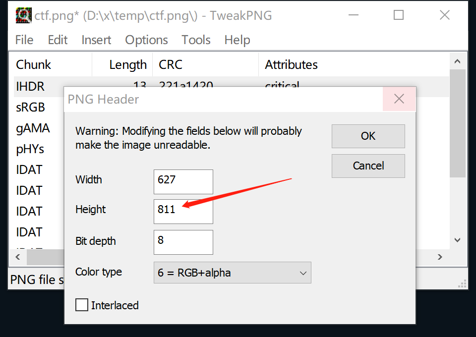

# 01.图片隐写一

题目只提供了一个在浏览器中无法正常显示的图片文件 `ctf.png` ，用 [TweakPNG](https://entropymine.com/jason/tweakpng/) 打开，会报CRC错误，如图：

按这种题目的套路，CRC错误通常意味着图片的高度或者宽度被改动过，但是没有正确更新CRC校验值。只要我们把图片高度或者宽度改大一些，也许就能发现隐藏的信息。先尝试改高度，在 `TweakPNG` 中，选中 `IHDR` 块，点鼠标右键，选择 `Edit Chunk...` 把高度 `511` 改为 `811` ，如图：

保存后，用windows操作系统自带的 `画图` 或者 `照片` 程序打开（windows自带程序会忽略CRC错误），即可见答案：

