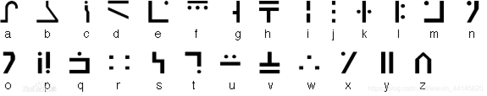

# 03.图片隐写三

题目只给出了一个文件 `ctf.rar` ，解压后得到两个文件： `flag.rar` 和 `解压密码.txt` 。 `flag.rar` 解压需要密码。在 `解压密码.txt` 文件中只有一串字符：

> 871abb62cf35761983fd9e07ec7bbbbdfca85075

目测不像简单的常用编码，可能是某种哈希值，基于其160位的长度，推测有可能是常用的 `SHA-1` ，找个在线解码服务扔过去，可以秒解，得到 `flag.rar` 解压密码：

> meiyoumima

`flag.rar` 解压后里面有三个文件： `1.png` 、 `2.png` 和 `flag.txt` ， `flag.txt` 里面提示flag为两个png文件内容的拼接。两个png文件的内容为一种叫做 **标准银河字母** 的编码方法，参照字母表解码、拼接即得答案。

标准银河字母表：

